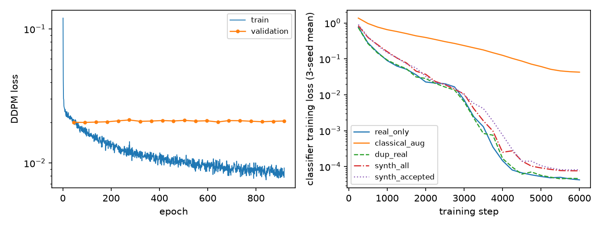
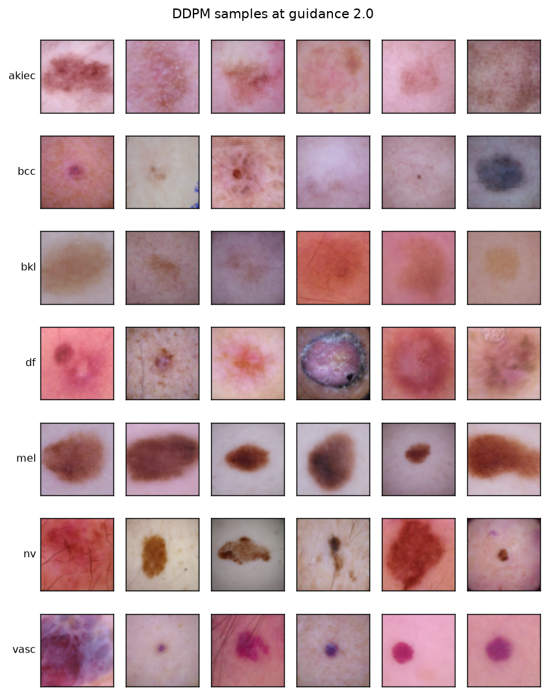
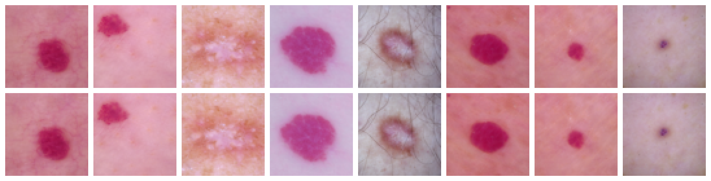
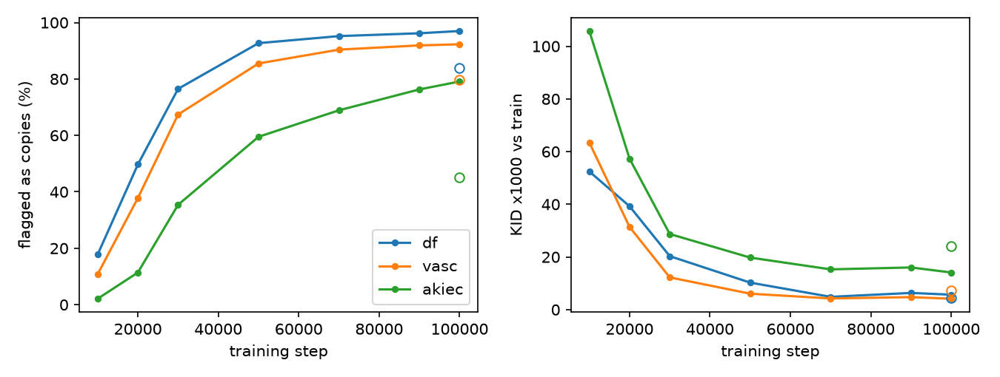

# Diffusion-Based Data Augmentation for Imbalanced Medical Image Classification

**MSML612 Group Project, Final Report**  
Team (2 members): Jack Maiorino, Rithvik Kommareddy  
Date: August 2026

---

## Abstract

We asked whether diffusion-generated images can improve a downstream classifier on the rare
classes of HAM10000, a severely imbalanced dermoscopic benchmark. We trained a
class-conditional 37.1M-parameter pixel-space DDPM from scratch on a leak-free lesion-level
split and generated 1,000 images per class. In this class-balanced run, a nearest-neighbor
check in two perceptual spaces, calibrated on real-to-real distances with whole-lesion
exclusion, flags 97% of generated dermatofibroma (df) images as near-copies of specific
training images; the flags trace to 81 of the 84 df training images. Flag rates generally
rise across training checkpoints as train-referenced KID falls. A size-matched held-out
analysis is less dramatic than the unmatched comparison: for df, median LPIPS is 0.134 to
an equal-sized training reference and 0.155 to validation, and 66.0% of synthetic images are
closer to train versus 63.7% for the real-data baseline. Filtering does not improve any of
the seven held-out KID point estimates, although subset variability is too wide to establish
each change inferentially. Across three classifier seeds, classical augmentation raises mean
rare-class F1 from 0.343 to 0.573; duplicated real, unfiltered synthetic, and filtered
synthetic data score 0.289, 0.299, and 0.290. These descriptive results provide no evidence
of a downstream gain from either synthetic arm and do not establish equivalence between
filtered synthetic and duplicated real data.

## 1. Problem Statement and Research Question

Clinical image datasets are long-tailed, and classifiers underperform exactly where reliable
detection matters most. Classical augmentation only perturbs existing pixels; generative
augmentation promises new samples. Diffusion models are the state of the art in image
generation and provide native class-conditional control, which motivated our original
question: can diffusion-generated images meaningfully improve a rare-class classifier? The
project's findings sharpened that question into the one this report answers:

> When a diffusion model is trained from scratch on tens of images per class, are its
> "synthetic" rare-class samples new images at all, and does anything they add to a
> classifier survive controlling for trivial oversampling?

## 2. Data

HAM10000 (Tschandl et al., 2018) contains 10,015 dermoscopic images in 7 classes, from 66.9%
melanocytic nevi (nv) down to 1.1% dermatofibroma (df). Many lesions are photographed more
than once (4,501 of 10,015 images share a lesion with another image), so a naive image-level
split leaks near-duplicates across the train/test boundary: averaged over 200 random
image-level splits, 34.9% of test images share a lesion with a training image, and the rate
is worst on the minority classes (mel 62.1%, df 51.1%). We therefore split at the lesion
level, stratified by class, 70/15/15, seed 612, keeping all images; an assertion verifies
that no lesion crosses splits. Full details are in the interim report; the resulting counts:

| Class | Train | Val | Test | Total |
|-------|------:|----:|-----:|------:|
| nv    | 4,679 | 1,015 | 1,011 | 6,705 |
| mel   |   776 |   163 |   174 | 1,113 |
| bkl   |   765 |   165 |   169 | 1,099 |
| bcc   |   354 |    77 |    83 |   514 |
| akiec |   227 |    55 |    45 |   327 |
| vasc  |    96 |    23 |    23 |   142 |
| df    |    84 |    15 |    16 |   115 |
| **All** | **6,981** | **1,513** | **1,521** | **10,015** |

df, with 84 training images from 51 distinct lesions, is the stress test the study turns on.

## 3. Generative Model

The generator is a class-conditional DDPM (Ho et al., 2020) built on the diffusers
`UNet2DModel` (von Platen et al., 2022), trained from scratch in pixel space at 64x64:
37.1M parameters, channels 128/256/256/256 with self-attention at 16x16 and 8x8, a cosine
noise schedule with T = 1000 (Nichol and Dhariwal, 2021), and classifier-free guidance
(Ho and Salimans, 2021) with label dropout 0.1. One shared model serves all classes so the
rare classes can reuse representations learned from the common ones, and training uses
class-balanced sampling so they receive equal gradient exposure. As run: 100,000 steps of
AdamW (Loshchilov and Hutter, 2019) at 1e-4, effective batch 64 (batch 32 with 2-step
gradient accumulation, which avoids VRAM spill on our 12 GB GPU), EMA decay 0.9999,
13.0 hours on a single GPU. Sampling uses DDIM (Song et al., 2021) at 50 steps with
guidance 2.0 and seed 612; we generated 1,000 images per class.

Figure 1 shows the loss curves. DDPM training loss falls throughout the run, from a mean
of 0.025 over the first 5k steps to 0.0085 near 100k. Validation loss, scored at each
saved checkpoint on the held-out split under identical noise, timestep, and label-drop
draws so the curve is comparable across checkpoints, is flat at 0.020 from the first
checkpoint (epoch 46) to the last (epoch 917). The widening train-validation gap means
the second half of training improves the fit to the training images, not to the
distribution; Section 5.3 shows the same pattern at the image level, where copying rises
across exactly these checkpoints. The classifier arms are trained by steps rather than
epochs because the five arms have different dataset sizes; validation macro-F1, logged
every 250 steps, selects each run's checkpoint (Section 6).

*Figure 1. Left: DDPM diffusion loss vs epoch, training (per-step) and validation (per
saved checkpoint, 4 fixed passes over the val split). Right: classifier training loss
for the five arms, 3-seed mean. Both y-axes are log scale.*

*Figure 2. EMA samples at 100k steps, guidance 2.0. Legible lesion morphology in every
class; the question the rest of the report answers is where that morphology comes from.*

## 4. Generative Quality by the Standard Metrics

Per-class FID and KID against the real training images, with a finite-sample real-split
reference formed by splitting each class's training set in half and scoring the halves.
This reference is not a floor: it uses two half-sized real samples, whereas the synthetic
comparison uses the full real class and 1,000 generated images, so the estimators have
different finite-sample behavior. KID is reported x1000. For four classes (akiec, bcc, df,
and vasc) the real-split FID reference exceeds the synthetic score, so FID is uninformative
there and we rank those classes by KID only.

| Class | FID | FID real-split ref. | KID | KID real-split ref. |
|-------|----:|--------------------:|----:|--------------------:|
| akiec | 46.52 | 70.96 | 14.10 | -0.35 |
| bcc   | 53.91 | 62.39 | 24.04 | 0.53 |
| bkl   | 59.58 | 41.07 | 29.42 | -0.15 |
| df    | 38.33 | 107.42 | 5.68 | 3.75 |
| mel   | 61.61 | 42.12 | 33.65 | 1.07 |
| nv    | 52.30 | 11.14 | 24.56 | -0.04 |
| vasc  | 43.40 | 105.67 | 4.14 | -5.27 |

The df and vasc reference entries also carry no variance: their halved train sets (42 and
48 images) sit below the 100-image KID subset cap, so every real-split subset is a
permutation of the same images and the reported reference is a single draw, not a tight
floor.

Taken at face value the two rarest classes, df and vasc, are the model's best. That reading
is wrong, and the reason is the subject of Section 5: a generator that copies its training
set can receive a low train-referenced KID by construction. These numbers are kept here
because they are the metrics the field defaults to, and because the gap between this table
and Section 5 is itself a finding: train-referenced fidelity metrics cannot be read as
generative quality without a memorization check next to them.

## 5. Memorization

### 5.1 Detection method

For every generated image we compute the nearest-neighbor distance to its class's real
training images in two spaces: LPIPS (Zhang et al., 2018), computed through an exact
algebraic decomposition that reduces it to squared Euclidean distance on precomputed
vectors, and cosine distance on unit-normalized InceptionV3 pool features. An image is
flagged when it falls below the 5th percentile of that class's real-to-real leave-one-out
nearest-neighbor distribution in either space. Flagged images are quarantined, not deleted.

Calibration matters more than the metric. HAM10000's repeated lesion views mean a plain
leave-one-out null still contains sibling images of the same lesion, which drags the null
distances down and makes the detector too lenient. We therefore recalibrated by excluding
the entire lesion, not just the identical image, from each real image's neighbor set. This
roughly doubles most thresholds (akiec LPIPS 0.033 to 0.092). All headline numbers below
use the lesion-calibrated thresholds; the union of two 5% rules has a nominal false-positive
rate between 5 and 10%, which is the baseline to read the table against.

### 5.2 The model copies its rare classes

| Class | Flagged (image null) | Flagged (lesion null) | Surviving images |
|-------|---------------------:|----------------------:|-----------------:|
| df    | 93.4% | 97.0% | 30 |
| vasc  | 89.8% | 92.3% | 77 |
| akiec | 50.1% | 79.1% | 209 |
| bcc   | 35.4% | 56.2% | 438 |
| bkl   |  4.1% | 25.0% | 750 |
| mel   |  4.6% | 16.9% | 831 |
| nv    |  0.7% |  2.8% | 972 |

Flagged fraction is strongly associated with inverse class size. This is consistent with
repeated exposure: under class-balanced sampling over 100k steps, each df training image was
presented roughly 11,000 times. Class size and per-image exposure are coupled in this design,
however, so this run does not identify the cause of the association. Visual inspection of
the worst and near-threshold examples supports the copy interpretation and suggests that the
threshold can miss visually similar pairs (Figure 3). Only nv, with 4,679 training images,
stays below the nominal false-positive band.

*Figure 3. The lowest-distance flagged pairs: each column pairs a generated image with its
nearest real training image. These are near-pixel copies.*

The copying is broad, not collapse onto a few prototypes: df's flags trace back to 81 of its
84 training images (50 of 51 lesions), vasc's to 88 of 96, akiec's to 163 of 227, and the
most-copied df source accounts for only 8% of flags. Thus the detected copying spans most of
the df and vasc training sets rather than a few sources.

### 5.3 Copying rises as train-referenced KID falls

We scored checkpoints from 10k to 100k steps, plus a guidance 1.0 probe at 100k (Figure 4).
Flag rates generally rise with training while train-referenced KID falls. But these two
curves are not independent: copies are close to the empirical training distribution by
definition, so train-KID improves as copying worsens. The trajectory is also not perfectly
monotonic at the point level (the 70k checkpoint beats 90k on both axes, and guidance 1.0
cuts df's flag rate from 97% to 84% at similar KID), so sampling choices move the numbers.
What no tested setting produced is an operating point that is simultaneously novel and
faithful: early checkpoints are novel but visibly unconverged (KID 52 to 106), late ones
are faithful by copying.

*Figure 4. Left: lesion-calibrated flag rate. Right: KID x1000 vs train. Open markers:
guidance 1.0 at 100k. Copying and train-referenced "quality" improve together, which is
exactly why train-referenced quality cannot be trusted here.*

### 5.4 Held-out comparison with size-matched references

A nearest-neighbor comparison is sensitive to the number of candidate references. The
training sets are larger than validation, so we repeatedly subsample each training class to
the validation class size before comparing distances. The table reports median LPIPS and
the fraction closer to the matched training reference, averaged over 20 seeded subsamples.
For the real-data baseline, each validation image plays the role of a generated image;
same-lesion validation neighbors are excluded.

| Class | Pool to train, matched | Pool to val | Pool closer to train | Real val to train, matched | Real val to val | Real closer to train |
|-------|-----------------------:|------------:|---------------------:|---------------------------:|----------------:|---------------------:|
| df    | 0.134 | 0.155 | 66.0% | 0.149 | 0.160 | 63.7% |
| vasc  | 0.112 | 0.153 | 73.1% | 0.155 | 0.173 | 45.0% |
| akiec | 0.122 | 0.135 | 64.6% | 0.141 | 0.145 | 42.8% |
| bcc   | 0.137 | 0.145 | 61.4% | 0.141 | 0.143 | 52.2% |
| bkl   | 0.145 | 0.148 | 55.8% | 0.145 | 0.148 | 51.6% |
| mel   | 0.151 | 0.160 | 62.8% | 0.146 | 0.149 | 57.6% |
| nv    | 0.125 | 0.125 | 52.1% | 0.096 | 0.096 | 48.5% |

Size matching changes the interpretation. For df, the train-to-validation distance ratio is
1.15 rather than 20.2, and the closer-to-train fraction is only 2.3 percentage points above
the real baseline. For vasc the ratio is 1.37 and the fraction is 28.1 points above baseline;
akiec also shows a substantial fraction difference. These held-out results are descriptive
and mixed, not an independent twenty-fold copying result. The lesion-calibrated flag rates,
source coverage, and inspected pairs in Section 5.2 remain the direct evidence of copying.

### 5.5 Filtering does not improve the held-out KID point estimates

The obvious salvage is to keep only the unflagged images. Measured against validation, all
seven accepted-pool KID point estimates are higher than their unfiltered counterparts. The
table reports KID x1000 mean +/- subset standard deviation, with real train scored against
validation as a reference:

| Class | Real train | All synthetic | Accepted only | Size-matched near-dup rate (all / accepted) |
|-------|-----------:|--------------:|--------------:|:-------------------------------------------:|
| akiec | 1.5 +/- 1.7 | 24.0 +/- 5.8 | 59.4 +/- 7.4 | 80% / 78% |
| bcc   | 4.1 +/- 2.7 | 43.6 +/- 7.8 | 69.9 +/- 7.5 | 72% / 68% |
| bkl   | 0.9 +/- 1.9 | 36.6 +/- 4.0 | 38.8 +/- 3.6 | 60% / 54% |
| df    | 6.7 +/- 9.0 | 15.0 +/- 14.6 | 26.1 +/- 10.3 | 76% / 30% |
| mel   | 1.3 +/- 1.8 | 40.5 +/- 5.4 | 43.0 +/- 5.2 | 49% / 44% |
| nv    | -0.1 +/- 1.9 | 26.6 +/- 5.5 | 28.3 +/- 5.7 | 3% / 2% |
| vasc  | 8.7 +/- 6.5 | 21.1 +/- 7.6 | 33.7 +/- 9.0 | 73% / 62% |

The held-out means support two observations. First, df's KID is 15.0 against
validation rather than 5.7 against train, consistent with train-referenced KID rewarding
copies. Second, filtering does not reveal a better-fidelity subset in these point estimates.
The subset standard deviations are neither paired confidence intervals nor hypothesis tests;
for example, df changes by 11.1 while the two subset standard deviations are 14.6 and 10.3.
We therefore do not claim that filtering conclusively worsens every class.

The final column substantially reduces the original pool-size confound. For each of 20 repeats, the
synthetic pool and real calibration set are subsampled to the same size: the smaller of the
pool size, class training size, and 500. The LPIPS threshold is recomputed on that real
subset with whole-lesion exclusion before the synthetic subset is scored. The matched real
null rate is 4.8 to 5.3% except for accepted df, whose 30-image quantile yields 6.7%.
The rare-class pool rates therefore remain far above their matched nulls after matching the
number of images evaluated. They are detector rates under this LPIPS rule, not
estimates of duplicate prevalence.

## 6. Downstream Comparison

The generative analysis motivates comparing synthetic data with a duplicated-real control.
The classifier architecture follows the interim plan: a ResNet-18 (He et al., 2016) trained
from scratch at 64x64 with class-balanced sampling. Architecture, AdamW optimizer, learning
rate schedule, 6,000-step budget, evaluation cadence, and seed IDs are fixed across regimes.
The arm manifest or train-time augmentation is the regime-defining difference. Five regimes
were run for three seeds each (612, 613, 614):

1. Real data only.
2. Real + classical augmentation (flips, rotation, color jitter).
3. Real + duplicated-real oversampling (matching regime 5's added volume with copies of
   real images: the control the memorization result makes essential).
4. Real + unfiltered synthetic (1,000 per class).
5. Real + filtered synthetic (the accepted pools of Section 5.5).

The real-only and classical arms use the 6,981-row real manifest, duplicated-real and
filtered-synthetic each add 3,307 class-matched rows, and unfiltered synthetic adds 7,000.
These are fixed manifests, not validation-selected mixing ratios. Validation macro-F1
selects the checkpoint only; its test set is then evaluated once for that seed and regime.
The primary summary is mean F1 on akiec, df, and vasc, with macro-F1 and balanced accuracy
secondary. Results below are mean +/- sample standard deviation across three seeds.

| Regime | Rare-class F1 (delta vs real) | Macro F1 | Balanced acc. |
|--------|:-----------------------------:|:--------:|:-------------:|
| 1 Real only | 0.343 +/- 0.016 (reference) | 0.438 +/- 0.014 | 0.422 +/- 0.027 |
| 2 Classical aug | 0.573 +/- 0.040 (+0.231) | 0.604 +/- 0.025 | 0.611 +/- 0.018 |
| 3 Duplicated-real | 0.289 +/- 0.011 (-0.054) | 0.420 +/- 0.002 | 0.446 +/- 0.021 |
| 4 Unfiltered synthetic | 0.299 +/- 0.022 (-0.044) | 0.432 +/- 0.012 | 0.414 +/- 0.018 |
| 5 Filtered synthetic | 0.290 +/- 0.048 (-0.052) | 0.416 +/- 0.029 | 0.399 +/- 0.033 |

| Regime | akiec F1 | df F1 | vasc F1 |
|--------|---------:|------:|--------:|
| 1 Real only | 0.232 +/- 0.026 | 0.068 +/- 0.072 | 0.727 +/- 0.066 |
| 2 Classical aug | 0.487 +/- 0.005 | 0.395 +/- 0.079 | 0.838 +/- 0.035 |
| 3 Duplicated-real | 0.184 +/- 0.012 | 0.111 +/- 0.033 | 0.571 +/- 0.013 |
| 4 Unfiltered synthetic | 0.181 +/- 0.034 | 0.060 +/- 0.053 | 0.656 +/- 0.073 |
| 5 Filtered synthetic | 0.118 +/- 0.069 | 0.032 +/- 0.055 | 0.721 +/- 0.113 |

Classical augmentation has the highest three-seed mean for every rare class and raises mean
rare-class F1 by 0.231 over real only. Neither synthetic arm improves the corresponding mean.
Filtered synthetic and duplicated real have nearly equal aggregate rare-class means, a
difference of +0.0016, but this is cancellation rather than demonstrated equivalence:
filtered-minus-duplicated differences are -0.066 for akiec, -0.080 for df, and +0.150 for
vasc. Their paired rare-class differences by seed are +0.0248, -0.0637, and +0.0436. With
only three seeds and no prediction-level bootstrap or predeclared equivalence margin, these
numbers show no observed synthetic-data gain in this experiment, not that filtered
synthetic and duplicated real are interchangeable in the population. Per-run
values are in `reports/classifier_runs.csv`, with arm summaries in
`reports/classifier_summary.csv`.

## 7. Discussion

**Plausible mechanism.** Class-balanced sampling, our deliberate defense against rare-class
neglect, multiplied each df image's expected exposure by roughly 12x relative to natural
frequency, to about 11,000 presentations over the run. This makes repeated exposure a
plausible contributor to the inverse class-size pattern. Exposure and class size are coupled,
however, and there is no natural-frequency control, so this study cannot identify balancing
as the cause. The supported scope is narrower: in this one 37M-parameter from-scratch DDPM
run, the smallest classes have the highest calibrated detection rates.

**Why we did not retrain.** The candidate mitigations, in the order we would try them, are
capping the oversampling weight (e.g. 90% empirical + 10% balanced sampling, which cuts
per-image exposure by 5 to 10x), dihedral train-time augmentation with an
augmentation-aware detector, a smaller model, scheduled guidance, and memorization-based
early stopping. Each costs a full 13-hour training run plus re-scoring, and a single
unreplicated attempt would support weaker claims than the analysis above. We chose to spend
the remaining budget characterizing the negative result and measuring its downstream cost.
The honest statement of scope: across the tested checkpoints, guidance scales, and sampler,
no acceptable operating point was observed; the experiment does not estimate true copy
prevalence (the detector's null rate is 5 to 10%, and it under-flags visually confirmed
near-copies), identify a single cause, or rule out untested mitigations.

**Limitations.** Everything is established at 64x64 on one generator run. The validation
references for the rarest classes are small (df 15, vasc 23 images), so held-out KID has
substantial subset variability. Size matching also shows that the earlier unmatched
train-versus-validation distance contrast was mostly a reference-count effect for df.
Classifier results cover three seeds and have no inferential or equivalence analysis. Flag
rates are detection rates under a calibrated threshold, not prevalence estimates. The
ethical stake is worth stating plainly: in a medical setting, lightly perturbed copies of
real patient images can create privacy risk while being presented as augmentation, so a
memorization check should accompany such a pipeline. The run JSONs did not record immutable
code and input hashes at execution time; the supplied run manifest is a post-hoc artifact
inventory, not execution attestation.

## 8. Deviations from the Interim Plan

- **The StyleGAN2-ADA baseline was dropped.** Once the memorization result landed, the
  informative comparison became synthetic-vs-duplicated-real, not diffusion-vs-GAN. A GAN
  trained on the same data would require its own memorization and downstream evaluation, and
  the available compute went to the checkpoint sweep and held-out analysis instead. No GAN
  evidence was collected, so this report makes no diffusion-vs-GAN claim.
- **Four regimes became five.** The replication control the interim report mentioned in
  passing (duplicated-real oversampling) was promoted to the decisive comparator, and the
  diffusion regime split into unfiltered and filtered variants.
- **Classifier replication and inference were reduced.** The interim protocol specified
  five paired seeds, per-class Wilcoxon tests with Holm correction, and prediction-level
  bootstrap intervals. Execution used three seeds and did not save prediction-level outputs,
  so none of those inferential analyses was performed. The report therefore treats the
  classifier results as descriptive means and standard deviations. Moreover, a two-sided
  exact signed-rank test with only five nonzero pairs could not attain p < 0.05, so the
  originally specified seed count was itself insufficient for that test.
- **Ratio selection and planned ablations were omitted.** The executed arms use one fixed
  manifest each; validation selects checkpoints, not mixing ratios. The 0/25/50/100% ratio
  sweep and the 25/50/100% generator sample-size study were not run.
- **The guidance sweep narrowed.** Instead of {1.0, 2.0, 3.0} for sample quality, we probed
  guidance 1.0 specifically for its effect on copying (Figure 4).

## 9. Related Work

The diffusion foundations are as in the interim report: DDPM (Ho et al., 2020), the cosine
schedule (Nichol and Dhariwal, 2021), classifier-free guidance (Ho and Salimans, 2021), and
the diffusers implementation (von Platen et al., 2022). Frid-Adar et al. (2018) and
Trabucco et al. (2024) report generative-augmentation gains; our result is a caution about
the regime where those gains are claimed with the least data. On measurement, FID is due to
Heusel et al. (2017), KID to Binkowski et al. (2018), and LPIPS to Zhang et al. (2018).
Our held-out comparison follows the train-versus-test distance intuition of Meehan et al.
(2020), but it does not implement their formal three-sample statistic or hypothesis test.
Carlini et al. (2023) extracted training images from large diffusion models; Dar et al.
(2025) documented the same phenomenon in medical diffusion models, including copies that
survive augmented training, which informed our choice not to treat augmentation alone as a
guaranteed fix.

## 10. References

1. Ho, J., Jain, A., and Abbeel, P. (2020). *Denoising Diffusion Probabilistic Models.* NeurIPS.
2. Nichol, A., and Dhariwal, P. (2021). *Improved Denoising Diffusion Probabilistic Models.* ICML.
3. Ho, J., and Salimans, T. (2021). *Classifier-Free Diffusion Guidance.* NeurIPS Workshop.
4. Tschandl, P., Rosendahl, C., and Kittler, H. (2018). *The HAM10000 Dataset.* Scientific Data.
5. Frid-Adar, M., et al. (2018). *GAN-based Synthetic Medical Image Augmentation for Increased CNN Performance in Liver Lesion Classification.* Neurocomputing.
6. Trabucco, B., et al. (2024). *Effective Data Augmentation with Diffusion Models.* ICLR.
7. Heusel, M., et al. (2017). *GANs Trained by a Two Time-Scale Update Rule Converge to a Local Nash Equilibrium.* NeurIPS.
8. Binkowski, M., et al. (2018). *Demystifying MMD GANs.* ICLR.
9. Zhang, R., et al. (2018). *The Unreasonable Effectiveness of Deep Features as a Perceptual Metric.* CVPR.
10. Meehan, C., Chaudhuri, K., and Dasgupta, S. (2020). *A Non-Parametric Test to Detect Data-Copying in Generative Models.* AISTATS.
11. Carlini, N., et al. (2023). *Extracting Training Data from Diffusion Models.* USENIX Security.
12. Dar, S. U. H., et al. (2025). *Unconditional Latent Diffusion Models Memorize Patient Imaging Data.* Nature Biomedical Engineering.
13. Karras, T., et al. (2020). *Training Generative Adversarial Networks with Limited Data (StyleGAN2-ADA).* NeurIPS.
14. von Platen, P., et al. (2022). *Diffusers: State-of-the-Art Diffusion Models.* GitHub. https://github.com/huggingface/diffusers
15. He, K., Zhang, X., Ren, S., and Sun, J. (2016). *Deep Residual Learning for Image Recognition.* CVPR.
16. Loshchilov, I., and Hutter, F. (2019). *Decoupled Weight Decay Regularization.* ICLR.
17. Song, J., Meng, C., and Ermon, S. (2021). *Denoising Diffusion Implicit Models.* ICLR.
