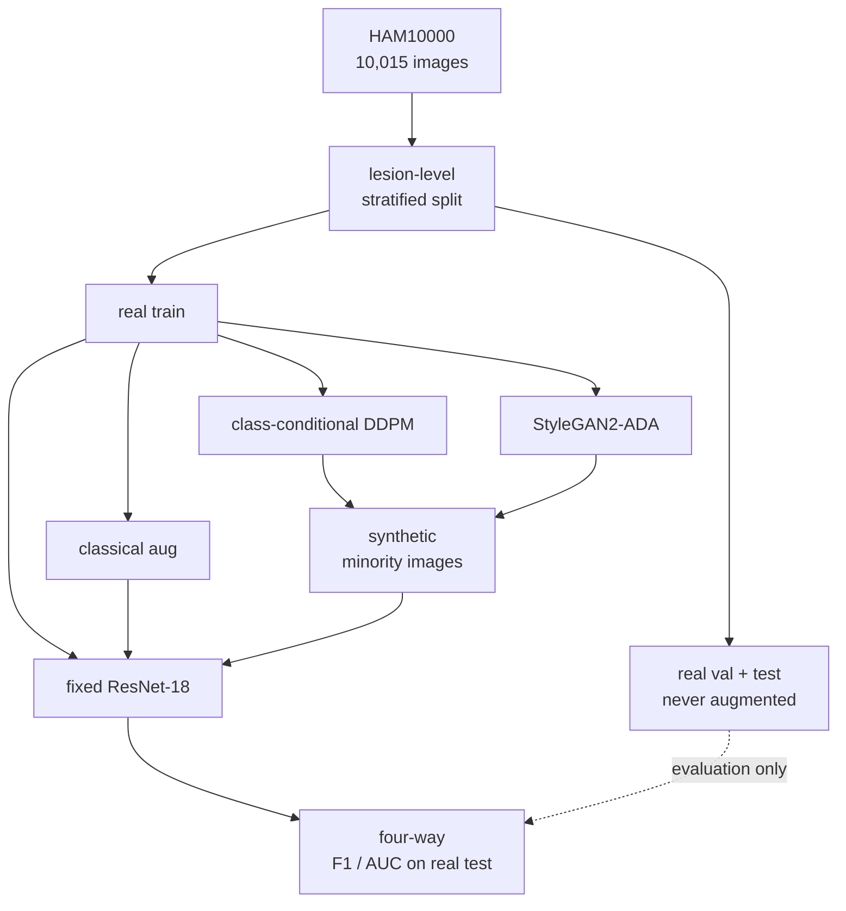
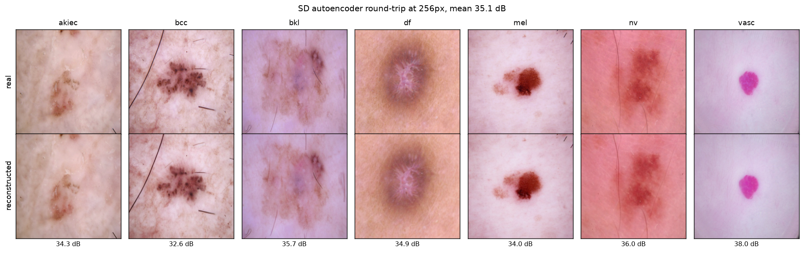

# Diffusion-Based Data Augmentation for Imbalanced Medical Image Classification

**MSML612 Group Project, Interim Report**  
Team (2 members): Jack Maiorino, Rithvik Kommareddy  
Date: July 2026

---

## Abstract

Clinical image datasets are long-tailed: the diagnoses that matter most are often the
rarest, and classifiers trained on such data underperform precisely where reliable
detection is most valuable. We ask whether diffusion-generated images can improve a
downstream classifier on rare classes, and whether they beat classical and GAN augmentation
in a controlled, leakage-free comparison. Our testbed is HAM10000, a severely imbalanced
dermoscopic benchmark. To date we have built and verified the full data pipeline, whose
lesion-level stratified split eliminates a substantial test-set leakage present in naive
image-level splitting while retaining every image, and we have run a feasibility study that
fixed our generative architecture, a class-conditional 37.1M-parameter pixel-space DDPM
trained from scratch. Remaining work is model training and the four-way augmentation
comparison, for which the measurement protocol is fully specified below.

## 1. Problem Statement and Research Question

Deep networks match expert accuracy on many medical imaging tasks, but only on large,
balanced datasets, a condition that rarely holds clinically. The standard remedy is data
augmentation. Classical augmentation (rotations, flips, color jitter) only perturbs existing
pixels and adds no new anatomical variation. GANs can synthesize new samples but suffer
unstable training and mode collapse on limited data. Diffusion models are the current state
of the art in image generation: high fidelity, diverse samples, stable training, and native
class-conditional control. This motivates our central research question.

> Can diffusion-generated synthetic images meaningfully improve a downstream medical
> classifier on rare classes, and does diffusion augmentation outperform classical and
> GAN-based augmentation?

The course requires choosing between a transformer and a diffusion model. That choice is
settled by the task: ours is image generation, for which diffusion is the natural,
state-of-the-art choice.

## 2. Data Preparation and Curation

### 2.1 Dataset

HAM10000 (Tschandl et al., 2018) contains 10,015 dermoscopic images across 7 diagnostic
classes, publicly available from the Harvard Dataverse (doi:10.7910/DVN/DBW86T). It is a
well-studied, severely imbalanced benchmark, which makes it an ideal testbed for a rare-class
augmentation study. The imbalance is stark: melanocytic nevi (nv) accounts for 6,705 images
(66.9%), roughly 58 times the 115 images of dermatofibroma (df). The per-class counts appear
in the split table in Section 2.3; the rare classes there are the ones augmentation must help.

### 2.2 The leakage problem, quantified

HAM10000 provides a `lesion_id` for every image, and many lesions are photographed more than
once. In the metadata, 4,501 of 10,015 images (44.9%) share a lesion with at least one other
image; 1,956 lesions have 2 or more images (up to 6). Two images of the same lesion are
near-duplicates.

A naive image-level random split therefore leaks. Averaged over 200 random image-level
70/15/15 splits (`preprocessing/leakage_analysis.py`), 34.9% of test images share a lesion
with a training image (std 1.1). Critically, the leakage is worst on exactly the minority
classes the study depends on: mel 62.1%, df 51.1%, bcc 50.2%, bkl 46.4%, vasc 42.6% and
akiec 41.9%, against only 26.6% on the majority class nv. A model evaluated under such a split
would report inflated numbers driven by memorized duplicates, not generalization, which
directly threatens the study's core claim: a measured F1 delta on the test set.

### 2.3 Our split: lesion-level, stratified, all images kept

We split at the lesion level rather than the image level: every image of a given lesion is
assigned to the same split. Splitting is stratified by class so each split preserves the
class distribution, using a fixed seed (612) and a 70/15/15 ratio. A runtime assertion
verifies that no lesion_id appears in more than one split; the split passes with zero
crossing lesions.

We depart from the proposal deliberately here. It planned to de-duplicate by lesion; we
instead keep every image and move the boundary to the lesion. That yields 10,015
training-eligible images versus 7,470 unique lesions, a 34% increase in usable data at no
leakage cost. For rare classes with only tens of training images, discarding a valid second
view is a real loss we avoid.

The resulting splits, with the full class distribution (sorted by frequency):

| Class | Full name | Train | Val | Test | Total | Share |
|-------|-----------|------:|----:|-----:|------:|------:|
| nv    | Melanocytic nevi                    | 4,679 | 1,015 | 1,011 | 6,705 | 66.9% |
| mel   | Melanoma                            |   776 |   163 |   174 | 1,113 | 11.1% |
| bkl   | Benign keratosis                    |   765 |   165 |   169 | 1,099 | 11.0% |
| bcc   | Basal cell carcinoma                |   354 |    77 |    83 |   514 |  5.1% |
| akiec | Actinic keratosis / Bowen's disease |   227 |    55 |    45 |   327 |  3.3% |
| vasc  | Vascular lesions                    |    96 |    23 |    23 |   142 |  1.4% |
| df    | Dermatofibroma                      |    84 |    15 |    16 |   115 |  1.1% |
| **All** | | **6,981** | **1,513** | **1,521** | **10,015** | 100% |

The split is written once to `data/splits.csv` (image_id, lesion_id, dx, split) and is the
single source of truth for every downstream consumer. df, with 84 training images, is the
hardest case and the main stress test for the generator.

### 2.4 Materialization and normalization

Images are sorted into `data/labeled/<class>/` and the split is materialized into
`data/splits/{train,val,test}/<class>/` directory trees using hard links, which is near-free
on disk. This lets standard loaders (PyTorch `ImageFolder`, Keras
`image_dataset_from_directory`, StyleGAN2-ADA) read a leak-free tree directly, instead of
relying on their built-in validation-split arguments, which shuffle within a class and would
re-introduce the exact lesion leakage we removed. A shared `HAM10000` dataset class provides
fixed global class indices and two normalization modes: [-1, 1] for the generative model and
ImageNet statistics for the classifier.

## 3. Neural Network Design

The project has three model components: the diffusion generator (ours, the core
contribution), a fixed downstream classifier (the measurement instrument), and two
augmentation baselines.

### 3.1 Generative model: class-conditional pixel-space DDPM

We implement a class-conditional Denoising Diffusion Probabilistic Model (Ho et al., 2020),
trained from scratch in pixel space at 64x64. We adapt the Hugging Face diffusers
`UNet2DModel` and `DDPMScheduler` (von Platen et al., 2022) from random initialization; the
adaptation is the class-conditioning embedding, the classifier-free-guidance dropout, the
64x64 channel configuration, and the domain training, while the residual-block and attention
machinery is reused from the library. The architecture is concrete:

| Field | Value |
|-------|-------|
| Base implementation | diffusers `UNet2DModel` + `DDPMScheduler`, random init |
| Input | 64 x 64 x 3 |
| Channels per stage (64, 32, 16, 8) | 128, 256, 256, 256 |
| Residual blocks per stage | 2 |
| Self-attention | at the 16x16 and 8x8 stages |
| Class conditioning | 8 embeddings (7 classes + 1 null for guidance), added to the timestep embedding |
| Parameters | 37.1M |

Training configuration (planned): AdamW at learning rate 1e-4, batch size 64, up to roughly
100k steps, exponential moving average of weights (decay 0.9999). The forward process uses a
cosine noise schedule (Nichol and Dhariwal, 2021) with T = 1000 steps; sampling uses DDIM at
50 steps. Classifier-free guidance (Ho and Salimans, 2021) drops the class label to the null
token with probability 0.1 during training, and at inference we sweep the guidance weight over
{1.0, 2.0, 3.0} to trade diversity against class fidelity, which is the control minority-class
augmentation needs. At 37.1M parameters and 64x64 the model fits a single 12 GB GPU with room
to spare, at an estimated single-digit GPU-hours to convergence, with the UMD Zaratan cluster
available for the multi-seed sweeps.

Two design choices carry most of the argument:

- **One shared model, not one per class.** A single conditional model sees all 6,981 training
  images and reuses representations across classes, while the class embedding steers output.
  This is our primary defense against memorization on df (84 images), where a dedicated
  per-class model would almost certainly overfit. To ensure the rare classes receive enough
  gradient exposure to benefit, DDPM training uses class-balanced sampling, matching the
  classifier's policy (Section 3.2), rather than the natural 67:1 frequency.
- **From-scratch, pixel-space, at 64x64.** We evaluated the latent-diffusion route first and
  set it aside on the evidence in Section 5.1. We also depart from the proposal's 256x256
  target and generate at 64x64, which keeps the from-scratch DDPM, the StyleGAN2-ADA baseline,
  and the multi-seed comparison all tractable on our compute budget.

### 3.2 Downstream classifier (measurement instrument)

The augmentation question is answered by a classifier held identical across all four regimes:
a ResNet-18 trained from scratch at 64x64 with class-balanced sampling. Random initialization
keeps the whole pipeline free of pretrained weights and is well matched to the 64x64 input,
where an ImageNet-pretrained backbone expecting 224x224 gains little. Its architecture,
optimizer, schedule, and seeds are fixed across regimes; only the training-set composition
changes, so the augmentation strategy is the only variable.

### 3.3 The four regimes

All four regimes share the same classifier, the same 64x64 resolution, and the same real-only
validation and test sets. No synthetic image ever touches evaluation.

1. **Real data only** (class-balanced sampling): the reference condition. Note it already
   oversamples minority images through balanced sampling, so it is a fair floor rather than a
   pure no-op.
2. **Classical augmentation**: horizontal and vertical flips, rotations, and color jitter, as
   implemented in `src/dataset.py`.
3. **GAN augmentation**: class-conditional StyleGAN2-ADA (Karras et al., 2020), the standard
   limited-data GAN, run with its published default recipe so it is not under-tuned relative
   to our diffusion model.
4. **Diffusion augmentation (ours)**: synthetic minority-class images from Section 3.1.

Regimes 2 to 4 mix synthetic or augmented images into the real training set; the classifier is
retrained and evaluated on the untouched real test set. To keep the comparison honest, all
four regimes are trained for the same number of gradient steps over the same total image
count, and we add a replication control that oversamples real minority images to match the
synthetic regimes' data volume without new content, isolating gains from volume alone versus
synthetic diversity.

The full pipeline:



*Figure 1. Experimental pipeline. Synthetic and augmented data enter only the training set;
validation and test stay real-only.*

## 4. Implementation and Code

The repository is organized for reproducibility with no manual steps between raw data and a
leak-free, materialized split.

```
preprocessing/
  sort_images.py        # raw images -> data/labeled/<class>/ (copy, keep all 10,015)
  make_splits.py        # lesion-level stratified split -> data/splits.csv (seed 612)
  make_split_dirs.py    # splits.csv -> data/splits/{train,val,test}/<class>/ (hard links)
  leakage_analysis.py   # quantifies naive-split leakage vs our lesion-level split
src/
  dataset.py            # shared HAM10000 loader, fixed class indices, 2 normalizations
  vae_roundtrip.py      # autoencoder feasibility study (Section 5.1)
requirements.txt        # pinned deps, CUDA 12.6 index
```

Two properties make the pipeline reproducible without manual intervention. For verified
integrity, `make_splits.py` asserts at runtime that no lesion crosses splits, so a leaking
split fails loudly instead of silently, and `leakage_analysis.py` regenerates the Section 2.2
numbers on demand. For a pinned environment, `requirements.txt` fixes exact versions against a
CUDA 12.6 wheel index, and the fixed split seed (612) reproduces `data/splits.csv` byte for
byte.

Implemented and runnable today: the four preprocessing scripts, the shared dataset loader, and
the feasibility study. In progress: the DDPM training and sampling scripts, and the classifier
and evaluation harness.

## 5. Progress, Results, and Evaluation Protocol

### 5.1 Result: autoencoder feasibility study

Before committing to an architecture we asked whether the image content survives compression,
which sets an upper bound on any latent approach. Encoding and decoding held-out images
through the pretrained SD autoencoder gives a mean round-trip PSNR of 35.1 dB, consistent
across classes (32.6 to 38.0 dB), with pigment networks, lesion borders, and hairs preserved
(Figure 2). Two conclusions: latent diffusion would not be bottlenecked by the decoder, and,
combined with the project's from-scratch requirement (training our own autoencoder as well is
out of scope for the timeline), this justified building a pixel-space model directly rather
than depending on pretrained latents.



*Figure 2. Real (top) vs autoencoder reconstruction (bottom), one per class, with per-class
PSNR. Deliberately run at the proposal's original 256px to bound what a latent approach could
have achieved, which is why its resolution differs from the final 64x64 model.*

### 5.2 Result: data integrity

The delivered split has zero lesions crossing the train/val/test boundary (asserted), against
a 34.9% test-set leak rate under the naive image-level baseline (Section 2.2). This is the
foundation that makes any later F1 delta trustworthy.

### 5.3 Evaluation protocol (specified, pending execution)

The downstream augmentation results are the project's main outcome and are not yet available,
since model training is the next phase. The immediate next measurable milestone is the
real-data-only classifier baseline. The measurement protocol is fixed:

- **Primary metric**: per-class F1 on the rare classes, reported as a delta over the
  real-data-only baseline. Success is diffusion augmentation (regime 4) beating regimes 1 to 3.
- **Secondary metrics**: macro-averaged F1, balanced accuracy, and per-class AUC.
- **Significance**: each regime is trained with 5 seeds, paired on seed (identical
  initialization and data order, only the injected images differ). We test per-class F1 deltas
  with a paired Wilcoxon signed-rank test and apply Holm-Bonferroni correction across the 7
  classes. Because the rare-class test sets are tiny (df 16, vasc 23, akiec 45 images, so F1
  moves in coarse steps), we supplement seed variance with bootstrap confidence intervals
  resampled from the test-set predictions.
- **Ratio selection**: the synthetic-to-real mixing ratio for each regime's headline number is
  chosen on the validation set; the test set is evaluated once per regime.
- **Generative quality**: FID (Heusel et al., 2017) is reported per class, not pooled (a
  pooled score is dominated by nv), and as a relative within-study ranking only, since at
  64x64 it is not comparable to literature values benchmarked at higher resolution. We add
  Kernel Inception Distance (KID), which is less biased on the small rare-class reference sets
  (df, vasc, akiec).
- **Memorization check**: every generated image gets a nearest-neighbor distance to the real
  training set of its class (LPIPS and Inception features), compared against the real-to-real
  nearest-neighbor distribution within that class. Samples below the 5th percentile are flagged
  as suspected copies and discarded before they reach the classifier; we report the flagged
  fraction per class.
- **Ablations**: a mixing-ratio sweep (0, 25, 50, 100% synthetic added to the real minority
  set) and a generator sample-size study (DDPM trained on 25, 50, 100% of the real rare-class
  images), to locate where synthetic data helps most.

| Regime | Rare-class F1 | Macro F1 | FID (per class) | Status |
|--------|:-------------:|:--------:|:---------------:|--------|
| Real data only  | pending | pending | n/a | protocol fixed |
| Classical       | pending | pending | n/a | protocol fixed |
| GAN (StyleGAN2-ADA) | pending | pending | pending | protocol fixed |
| Diffusion (ours)    | pending | pending | pending | protocol fixed |

Conclusions from this study are established at 64x64; resolution-scaling behavior toward
full-resolution dermoscopy is out of scope. If a from-scratch DDPM fails to produce legible
rare-class samples, the fallbacks are heavier EMA and regularization, additional class-balanced
oversampling, or narrowing scope to the classes that do converge.

## 6. Related Work

Diffusion foundations. DDPM (Ho et al., 2020) established the denoising formulation we
build on; Improved DDPM (Nichol and Dhariwal, 2021) contributed the cosine noise schedule we
adopt; latent diffusion (Rombach et al., 2022) moved generation into a compressed latent
space, the route our feasibility study evaluated. Dhariwal and Nichol (2021) showed diffusion
surpasses GANs on image synthesis, and classifier-free guidance (Ho and Salimans, 2021)
provides the conditional control our minority-class task requires.

Generative augmentation. Frid-Adar et al. (2018) showed GAN-synthesized medical images
improve a CNN on liver-lesion classification, an early positive result for synthetic
augmentation. Trabucco et al. (2024) demonstrated diffusion-based augmentation gains on
general vision benchmarks. Whether such gains are real information or re-encoded generator
bias is still debated, which our controlled, leakage-free comparison is designed to address.

Baselines and metrics. StyleGAN2-ADA (Karras et al., 2020) is the standard limited-data
GAN and our GAN baseline; FID (Heusel et al., 2017) is the standard generative-quality metric.
HAM10000 (Tschandl et al., 2018) is our dataset, and we adapt the diffusers library (von Platen
et al., 2022) for the diffusion model.

## 7. Remaining Work and Timeline

| Phase | Status |
|-------|--------|
| Data pipeline and leak-free splits | Done |
| Architecture feasibility study | Done |
| DDPM training and sampling | Next |
| Classifier and evaluation harness | In progress |
| Classical and StyleGAN2-ADA baselines | Planned |
| Four-way comparison, ablations, significance tests | Planned |
| Final figures, report, presentation | Planned |

Training runs use local GPUs and the UMD Zaratan HPC cluster (Slurm, mixed precision) as
needed. The nearest milestones are the real-data-only classifier baseline and a trained
conditional DDPM producing recognizable per-class samples, followed by the first
no-augmentation-vs-diffusion comparison.

## 8. References

1. Ho, J., Jain, A., and Abbeel, P. (2020). *Denoising Diffusion Probabilistic Models.* NeurIPS.
2. Nichol, A., and Dhariwal, P. (2021). *Improved Denoising Diffusion Probabilistic Models.* ICML.
3. Rombach, R., et al. (2022). *High-Resolution Image Synthesis with Latent Diffusion Models.* CVPR.
4. Dhariwal, P., and Nichol, A. (2021). *Diffusion Models Beat GANs on Image Synthesis.* NeurIPS.
5. Ho, J., and Salimans, T. (2021). *Classifier-Free Diffusion Guidance.* NeurIPS Workshop.
6. Tschandl, P., Rosendahl, C., and Kittler, H. (2018). *The HAM10000 Dataset.* Scientific Data.
7. Frid-Adar, M., et al. (2018). *GAN-based Synthetic Medical Image Augmentation for Increased CNN Performance in Liver Lesion Classification.* Neurocomputing.
8. Trabucco, B., et al. (2024). *Effective Data Augmentation with Diffusion Models.* ICLR.
9. Karras, T., et al. (2020). *Training Generative Adversarial Networks with Limited Data (StyleGAN2-ADA).* NeurIPS.
10. Heusel, M., et al. (2017). *GANs Trained by a Two Time-Scale Update Rule Converge to a Local Nash Equilibrium (FID).* NeurIPS.
11. von Platen, P., et al. (2022). *Diffusers: State-of-the-Art Diffusion Models.* GitHub. https://github.com/huggingface/diffusers
